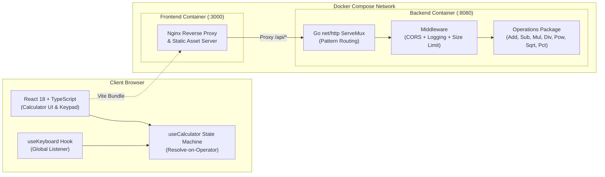

# Goldoni Calculator — Full-Stack Monorepo

A modern, production-grade Full-Stack Calculator web application built with a **Go standard library backend** and a **React 18 + TypeScript + Vite frontend**.
The application strictly delegates all mathematical evaluations to the backend REST API, enforcing zero client-side evaluation, strict separation of concerns, and robust state machine handling.

---

## Quick Start & Lifecycle Commands

| Target | Command | Description |
| :--- | :--- | :--- |
| `make docker` | `docker compose up --build` | Builds and boots backend and frontend containers with health checks. |
| `make docker-down` | `docker compose down` | Stops and removes running Docker containers, networks, and services. |
| `make docker-rebuild` | `docker compose build --no-cache && docker compose up --force-recreate` | Forces a clean rebuild with no cache and recreates containers. |
| `make test` | `make test-backend && make test-frontend` | Runs the full automated test suite for both backend and frontend. |
| `make clean` | `docker compose down -v --remove-orphans && rm -f backend/coverage.out && rm -rf frontend/coverage frontend/dist` | Cleans up containers, volumes, orphans, and local build/coverage artifacts. |
| `make dev-backend` | `cd backend && go run main.go` | Starts the Go backend server locally on port 8080. |
| `make dev-frontend` | `cd frontend && npm run dev` | Starts the Vite frontend dev server locally on port 5173 with API proxying. |

### Service URLs

- **Frontend Application**: [http://localhost:3000](http://localhost:3000) (Docker Compose) / [http://localhost:5173](http://localhost:5173) (Local Dev)
- **Backend API**: [http://localhost:8080](http://localhost:8080)
- **Backend Health Check**: [http://localhost:8080/health](http://localhost:8080/health)

---

## Architecture & Monorepo Layout

### Architecture Diagram



### Monorepo Layout

```
goldoni-calculator/
├── backend/                        # Go REST API backend
│   ├── handler/                    # HTTP handlers, routes, request/response models
│   │   ├── handler.go              # MakeHandler generic factory, payload validation
│   │   ├── handler_test.go         # Handler test suite (90.3% coverage)
│   │   ├── health.go               # Health check handler
│   │   └── routes.go               # Route registration (net/http ServeMux)
│   ├── middleware/                 # HTTP middleware
│   │   ├── cors.go                 # CORS configuration
│   │   ├── cors_test.go            # CORS tests
│   │   ├── logging.go              # Structured HTTP request logging
│   │   └── logging_test.go         # Logging tests
│   ├── operations/                 # Pure mathematical operations
│   │   ├── operations.go           # Arithmetic functions with error definitions
│   │   └── operations_test.go      # Operations unit tests (100% coverage)
│   ├── Dockerfile                  # Multi-stage minimal container build
│   ├── go.mod                      # Go module (zero external dependencies)
│   └── main.go                     # Application entry point
├── frontend/                       # React 18 + TypeScript frontend
│   ├── src/
│   │   ├── api/                    # REST API client
│   │   │   ├── calculator.ts       # Endpoint mapping and HTTP client
│   │   │   └── calculator.test.ts  # API client tests
│   │   ├── components/             # React UI components
│   │   │   ├── Button/             # Reusable calculator keypad button
│   │   │   │   ├── Button.tsx
│   │   │   │   ├── Button.module.css
│   │   │   │   └── Button.test.tsx
│   │   │   ├── Display/            # Dual-line expression/result display
│   │   │   │   ├── Display.tsx
│   │   │   │   ├── Display.module.css
│   │   │   │   └── Display.test.tsx
│   │   │   ├── Calculator.tsx      # Main calculator layout
│   │   │   ├── Calculator.module.css
│   │   │   └── Calculator.test.tsx # Calculator integration tests
│   │   ├── hooks/                  # Custom React hooks
│   │   │   ├── useCalculator.ts    # Calculator state machine & API coordination
│   │   │   ├── useCalculator.test.ts # Comprehensive state machine test suite
│   │   │   ├── useKeyboard.ts      # Physical keyboard event listener
│   │   │   └── useKeyboard.test.ts # Keyboard hook tests
│   │   ├── types/                  # TypeScript interface definitions
│   │   │   └── index.ts
│   │   ├── App.tsx                 # Root application component
│   │   ├── App.test.tsx            # Root smoke tests
│   │   ├── index.css               # Global styles & theme variables
│   │   └── main.tsx                # Frontend entry point
│   ├── Dockerfile                  # Multi-stage build (Node build → Nginx serve)
│   ├── nginx.conf                  # Nginx configuration (reverse proxy /api)
│   ├── package.json                # NPM configuration & dependencies
│   ├── tsconfig.json               # TypeScript configuration
│   └── vite.config.ts              # Vite dev server with /api proxy
├── ai-workflow/                    # AI development workflow & prompt history
│   ├── 01-challenge-requirements.md # Engineering challenge requirements
│   ├── 02-initial-prompt.md        # Initial draft prompt
│   ├── 03-ready-prompt.md          # Refined, production-ready specification
│   ├── 04-ui-ux-refinement-prompt.md # UI/UX layout stabilization & 2048 theming
│   └── AI_WORKFLOW.md              # Workflow methodology & context economics
├── .github/workflows/
│   └── ci.yml                      # GitHub Actions CI pipeline
├── docker-compose.yml              # Single-command orchestration
├── Makefile                        # Developer commands
└── README.md                       # Documentation
```

---

## REST API Reference

All computational endpoints use the `POST` method with JSON payloads. The server validates payloads, enforces a 1KB body limit, and requires `Content-Type: application/json`.

### Endpoints Table

| Method | Endpoint | Expected Arguments | Description | Expression Format |
| :--- | :--- | :--- | :--- | :--- |
| `POST` | `/api/add` | `[a, b]` (2 numbers) | Adds two numbers ($a + b$) | `"a + b"` |
| `POST` | `/api/subtract` | `[a, b]` (2 numbers) | Subtracts second number from first ($a - b$) | `"a - b"` |
| `POST` | `/api/multiply` | `[a, b]` (2 numbers) | Multiplies two numbers ($a \times b$) | `"a * b"` |
| `POST` | `/api/divide` | `[a, b]` (2 numbers) | Divides first number by second ($a / b$) | `"a / b"` |
| `POST` | `/api/power` | `[base, exp]` (2 numbers) | Calculates exponentiation ($base^{exp}$) | `"base ^ exp"` |
| `POST` | `/api/sqrt` | `[val]` (1 number) | Calculates principal square root ($\sqrt{val}$) | `"sqrt(val)"` |
| `POST` | `/api/percentage` | `[val]` (1 number) | Computes percentage scaling ($val / 100$) | `"val%"` |
| `GET` | `/health` | None | Returns service liveness status | N/A |

---

### HTTP Status Codes

| Status Code | Meaning | Scenario |
| :--- | :--- | :--- |
| `200 OK` | Success | Calculation executed and returned successfully. |
| `400 Bad Request` | Client Error | Malformed JSON, incorrect argument count, non-numeric values, or `NaN`/`Infinity`. |
| `404 Not Found` | Route Not Found | Unrecognized endpoint or unsupported HTTP method. |
| `413 Payload Too Large` | Entity Limit Exceeded | Request body exceeds the 1KB security limit. |
| `415 Unsupported Media Type` | Content-Type Header Invalid | Missing or invalid `Content-Type` header (must be `application/json`). |
| `422 Unprocessable Entity` | Mathematical Error | Division by zero, square root of negative number, or arithmetic overflow. |

---

### Request & Response Examples for All Operations

#### 1. Addition (`POST /api/add`)
**Request:**
```http
POST /api/add HTTP/1.1
Content-Type: application/json

{
  "arguments": [12.5, 7.5]
}
```
**Response (200 OK):**
```json
{
  "result": 20,
  "expression": "12.5 + 7.5"
}
```

---

#### 2. Subtraction (`POST /api/subtract`)
**Request:**
```http
POST /api/subtract HTTP/1.1
Content-Type: application/json

{
  "arguments": [50, 18.5]
}
```
**Response (200 OK):**
```json
{
  "result": 31.5,
  "expression": "50 - 18.5"
}
```

---

#### 3. Multiplication (`POST /api/multiply`)
**Request:**
```http
POST /api/multiply HTTP/1.1
Content-Type: application/json

{
  "arguments": [6, 7]
}
```
**Response (200 OK):**
```json
{
  "result": 42,
  "expression": "6 * 7"
}
```

---

#### 4. Division (`POST /api/divide`)
**Request:**
```http
POST /api/divide HTTP/1.1
Content-Type: application/json

{
  "arguments": [100, 8]
}
```
**Response (200 OK):**
```json
{
  "result": 12.5,
  "expression": "100 / 8"
}
```

---

#### 5. Exponentiation (`POST /api/power`)
**Request:**
```http
POST /api/power HTTP/1.1
Content-Type: application/json

{
  "arguments": [2, 8]
}
```
**Response (200 OK):**
```json
{
  "result": 256,
  "expression": "2 ^ 8"
}
```

---

#### 6. Square Root (`POST /api/sqrt`)
**Request:**
```http
POST /api/sqrt HTTP/1.1
Content-Type: application/json

{
  "arguments": [144]
}
```
**Response (200 OK):**
```json
{
  "result": 12,
  "expression": "sqrt(144)"
}
```

---

#### 7. Percentage (`POST /api/percentage`)
**Request:**
```http
POST /api/percentage HTTP/1.1
Content-Type: application/json

{
  "arguments": [250]
}
```
**Response (200 OK):**
```json
{
  "result": 2.5,
  "expression": "250%"
}
```

---

#### 8. Health Check (`GET /health`)
**Request:**
```http
GET /health HTTP/1.1
```
**Response (200 OK):**
```json
{
  "status": "ok"
}
```

---

### Error Scenarios & Responses

#### Division by Zero
**Request:** `POST /api/divide` `{"arguments": [42, 0]}`  
**Response (422 Unprocessable Entity):**
```json
{
  "error": "division by zero",
  "expression": "42 / 0"
}
```

#### Square Root of Negative Number
**Request:** `POST /api/sqrt` `{"arguments": [-16]}`  
**Response (422 Unprocessable Entity):**
```json
{
  "error": "square root of negative number",
  "expression": "sqrt(-16)"
}
```

#### Arithmetic Overflow
**Request:** `POST /api/power` `{"arguments": [1e200, 2]}`  
**Response (422 Unprocessable Entity):**
```json
{
  "error": "result overflow",
  "expression": "1e+200 ^ 2"
}
```

#### Invalid Arguments (NaN / Infinity Disallowed)
**Request:** `POST /api/add` `{"arguments": ["NaN", 10]}`  
**Response (400 Bad Request):**
```json
{
  "error": "invalid argument: NaN and Infinity are not allowed"
}
```

#### Incorrect Argument Count
**Request:** `POST /api/add` `{"arguments": [5]}`  
**Response (400 Bad Request):**
```json
{
  "error": "expected 2 arguments, got 1"
}
```

#### Malformed JSON Payload
**Request:** `POST /api/add` `{"arguments": [5,`  
**Response (400 Bad Request):**
```json
{
  "error": "malformed JSON"
}
```

#### Invalid Content-Type Header
**Request:** `POST /api/add` with `Content-Type: text/plain`  
**Response (415 Unsupported Media Type):**
```json
{
  "error": "Content-Type must be application/json"
}
```

#### Payload Too Large (> 1KB)
**Request:** `POST /api/add` with request body exceeding 1024 bytes  
**Response (413 Request Entity Too Large):**
```json
{
  "error": "request body too large"
}
```

---

## Verified Test Coverage Summary

Both backend and frontend maintain extensive automated test suites with high coverage thresholds.

### Backend Coverage (Go)

| Package | Statement Coverage | Status |
| :--- | :--- | :--- |
| `backend/operations` | **100.0%** | Passed |
| `backend/middleware` | **100.0%** | Passed |
| `backend/handler` | **90.3%** | Passed |
| **Total Backend** | **94.7%** | **Passed** |

To execute backend tests with coverage:
```bash
make test-backend
```

---

### Frontend Coverage (Vitest + V8)

| Category / File | % Statements | % Branch | % Functions | % Lines | Status |
| :--- | :--- | :--- | :--- | :--- | :--- |
| **All Files** | **96.5%** | **90.4%** | **100.0%** | **96.5%** | **Passed** |
| `src/App.tsx` | 100.0% | 100.0% | 100.0% | 100.0% | Passed |
| `src/components/Calculator.tsx` | 100.0% | 100.0% | 100.0% | 100.0% | Passed |
| `src/components/Button/Button.tsx` | 100.0% | 100.0% | 100.0% | 100.0% | Passed |
| `src/components/Display/Display.tsx` | 100.0% | 100.0% | 100.0% | 100.0% | Passed |
| `src/api/calculator.ts` | 100.0% | 88.9% | 100.0% | 100.0% | Passed |
| `src/hooks/useKeyboard.ts` | 100.0% | 100.0% | 100.0% | 100.0% | Passed |
| `src/hooks/useCalculator.ts` | 93.4% | 85.8% | 100.0% | 93.4% | Passed |

To execute frontend tests with coverage:
```bash
make test-frontend
```

---

## Key Architectural & Design Decisions

### 1. HTTP POST for All Mathematical Operations (POST vs GET Rationale)
* **Decision**: All computational endpoints (`/api/add`, `/api/subtract`, etc.) use HTTP `POST` with JSON request bodies rather than `GET` with query parameters.
* **Rationale**:
  - `POST` with JSON body provides a uniform request signature across both unary (`[x]`) and binary (`[x, y]`) operations.
  - HTTP `GET` requests with bodies are non-standard; intermediate HTTP proxies, reverse proxies, and browser caches frequently strip or reject `GET` request bodies.
  - Passing arguments as JSON arrays avoids float serialization anomalies and escaping issues inherent in URL query parameters.

### 2. Code Symbols vs Display Symbols
* **Decision**: The backend returns canonical programming operator symbols in its `expression` response (`*`, `/`, `^`, `sqrt`, `%`), while the frontend displays human-friendly typography (`×`, `÷`, `√`).
* **Rationale**:
  - Strict separation of concerns: Backend responses provide unambiguous, language-agnostic data contracts.
  - Presentation formatting (e.g., Unicode mathematical symbols, localization) remains solely the responsibility of the UI layer.

### 3. Resolve-on-Operator State Machine Model
* **Decision**: The calculator uses a standard resolve-on-operator model (matching traditional physical pocket calculators like Casio or Sharp) rather than client-side expression AST parsing.
* **Rationale**:
  - Eliminates the need for client-side expression parsers or risky `eval()` calls.
  - When a user enters `5 + 3 ×`, the state machine immediately evaluates `5 + 3 = 8` via a backend API call, displays `8 ×`, and prepares for the next operand.
  - Each calculation step is an isolated, atomic HTTP request to the backend.

### 4. Percentage Design as Unary Postfix Scaling
* **Decision**: The percentage operation is modeled as a unary postfix operation that scales the active operand by `0.01` (`val / 100`).
* **Rationale**:
  - In a single-operation REST architecture, unary percentage immediately transforms the current buffer (e.g. `25 %` $\rightarrow$ `0.25`), allowing straightforward composition with binary operators (`200 × 25% = 50`).

### 5. Zero-Dependency Go Backend
* **Decision**: The backend uses purely Go standard library packages (`net/http`, `encoding/json`, `math`, `strconv`, `mime`).
* **Rationale**:
  - Go 1.22+ standard library `net/http.ServeMux` natively supports HTTP method matching and route patterns (e.g., `POST /api/add`).
  - Zero third-party dependencies guarantees maximum security, zero supply-chain vulnerabilities, instantaneous compilation, and ultra-lightweight Docker images.

### 6. Production Reverse Proxy via Nginx
* **Decision**: In production (Docker Compose), Nginx acts as both the static file server for the built Vite assets and the reverse proxy for `/api/*` requests to the Go backend.
* **Rationale**:
  - Eliminates CORS requirements in production environments by serving the SPA and API from the same origin.
  - Provides production-grade connection handling, static asset caching, and gzip compression.

---

## AI Tooling & Workflow

This application was developed using a structured, two-phase AI engineering workflow with subagent isolation and automated review loops.

For detailed documentation on the prompt refinement lifecycle, decision logs, and context economics, please refer to the [`ai-workflow/`](ai-workflow/) directory:

- [`ai-workflow/AI_WORKFLOW.md`](ai-workflow/AI_WORKFLOW.md) — Comprehensive explanation of the Product Owner + Software Engineer AI workflow, context isolation economics (short, cost-efficient context windows), and reviewer verification gates.
- [`ai-workflow/01-challenge-requirements.md`](ai-workflow/01-challenge-requirements.md) — Engineering challenge requirements and technical constraints.
- [`ai-workflow/02-initial-prompt.md`](ai-workflow/02-initial-prompt.md) — Initial prompt draft prior to gap analysis and refinement.
- [`ai-workflow/03-ready-prompt.md`](ai-workflow/03-ready-prompt.md) — Fully refined, production-ready specification driving implementation.
- [`ai-workflow/04-ui-ux-refinement-prompt.md`](ai-workflow/04-ui-ux-refinement-prompt.md) — Real-world UI/UX refinement iteration (fixing layout shifts on long decimals, decimal formatting, and gradient color palette).

---

## Continuous Integration

A GitHub Actions workflow is configured in [`.github/workflows/ci.yml`](.github/workflows/ci.yml) to automatically run tests and verify coverage on all pushes and pull requests to `main` and `master`:
- **Backend Job**: Sets up Go 1.23, executes all package unit tests with coverage reporting.
- **Frontend Job**: Sets up Node.js 22, installs dependencies via `npm ci`, and runs Vitest test suites with V8 coverage analysis.
