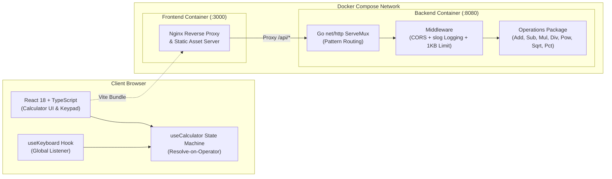

# Goldoni Calculator — Full-Stack Monorepo

A lightweight, production-grade calculator built with a **Go standard library REST backend** and a **React 18 + TypeScript + Vite frontend**.  
All calculations are strictly processed on the backend with zero client-side evaluation, strict input validation, and a robust state machine.

---

## Quick Start & Lifecycle Commands

| Target | Command | Description |
| :--- | :--- | :--- |
| `make docker` | `docker compose up --build` | Builds and boots backend and frontend containers with health checks. |
| `make docker-down` | `docker compose down` | Stops and removes running containers and networks. |
| `make docker-rebuild` | `docker compose build --no-cache && docker compose up --force-recreate` | Forces a clean rebuild without cache and restarts services. |
| `make test` | `make test-backend && make test-frontend` | Runs backend unit/HTTP tests and frontend Vitest suites with coverage. |
| `make clean` | `docker compose down -v --remove-orphans && rm -f backend/coverage.out && rm -rf frontend/coverage frontend/dist` | Cleans containers, volumes, orphans, and local build/coverage artifacts. |
| `make dev-backend` | `cd backend && go run main.go` | Starts the Go backend server locally on port 8080. |
| `make dev-frontend` | `cd frontend && npm run dev` | Starts the Vite dev server locally on port 5173 with API proxying. |

### Service URLs

- **Frontend UI**: [http://localhost:3000](http://localhost:3000) (Docker Compose) / [http://localhost:5173](http://localhost:5173) (Local Dev)
- **Backend API**: [http://localhost:8080](http://localhost:8080)
- **Health Check**: [http://localhost:8080/health](http://localhost:8080/health)

---

## Architecture & Monorepo Layout

### Architecture Diagram



### Monorepo Directory Tree

```
goldoni-calculator/
├── backend/                        # Go REST API backend (Zero external dependencies)
│   ├── handler/                    # HTTP handlers, routes, request/response models
│   │   ├── handler.go              # Generic MakeHandler factory & validation
│   │   ├── handler_test.go         # HTTP handler unit tests (90.3% coverage)
│   │   ├── health.go               # Liveness health check handler
│   │   └── routes.go               # Route registration with net/http ServeMux
│   ├── middleware/                 # Middleware pipeline
│   │   ├── cors.go                 # CORS handler for local dev origins
│   │   ├── cors_test.go            # CORS tests (100.0% coverage)
│   │   ├── logging.go              # Structured JSON logging via log/slog
│   │   └── logging_test.go         # Logging tests (100.0% coverage)
│   ├── operations/                 # Pure arithmetic domain logic
│   │   ├── operations.go           # Add, Subtract, Multiply, Divide, Power, Sqrt, Percentage
│   │   └── operations_test.go      # Domain math tests (100.0% coverage)
│   ├── Dockerfile                  # Multi-stage build (Alpine non-root binary)
│   ├── go.mod                      # Go module definition (Go 1.23)
│   └── main.go                     # Server lifecycle, graceful shutdown & ASCII banner
├── frontend/                       # React 18 + TypeScript + Vite SPA
│   ├── src/
│   │   ├── api/                    # Backend REST API client
│   │   │   ├── calculator.ts       # Endpoint dispatch & HTTP error mapping
│   │   │   └── calculator.test.ts  # API client tests
│   │   ├── components/             # Reusable UI components
│   │   │   ├── Button/             # Keypad button (numeric, operator, control, action)
│   │   │   ├── Display/            # Dual-line expression & result display (3-decimal truncation)
│   │   │   └── Calculator.tsx      # Calculator shell with 2048-inspired styling
│   │   ├── hooks/                  # Custom React hooks
│   │   │   ├── useCalculator.ts    # Finite state machine (Resolve-on-Operator)
│   │   │   └── useKeyboard.ts      # Keyboard event listener (NumPad, Enter, Esc, Backspace)
│   │   ├── types/                  # Shared TypeScript interfaces & types
│   │   ├── App.tsx                 # Application root
│   │   └── index.css               # Warm 2048-inspired theme variables & responsive styles
│   ├── Dockerfile                  # Multi-stage build (Node 22 build → Nginx Alpine serve)
│   ├── nginx.conf                  # Nginx configuration (Static SPA + /api reverse proxy)
│   ├── package.json                # Frontend dependencies and scripts
│   ├── tsconfig.json               # TypeScript strict configuration
│   └── vite.config.ts              # Vite dev server with /api proxy target
├── ai-workflow/                    # Structured AI prompt refinement artifacts
│   ├── 01-challenge-requirements.md# Original challenge requirements & constraints
│   ├── 02-initial-prompt.md        # Initial draft prompt before refinement
│   ├── 03-ready-prompt.md          # Production-ready implementation specification
│   ├── 04-ui-ux-refinement-prompt.md# UI/UX stabilization prompt (2048 theme & layout)
│   └── AI_WORKFLOW.md              # Context economics, role isolation & review workflow
├── .github/workflows/
│   └── ci.yml                      # GitHub Actions CI pipeline (Backend & Frontend matrix)
├── docker-compose.yml              # Container orchestration with health checks
├── Makefile                        # Unified developer commands
└── README.md                       # Repository documentation
```

---

## REST API Reference

All calculation endpoints accept `POST` requests with JSON payloads and enforce a **1KB body limit**. Requests must specify `Content-Type: application/json`.

### Endpoints Table

| Method | Endpoint | Arguments | Description | Expression Format |
| :--- | :--- | :--- | :--- | :--- |
| `POST` | `/api/add` | `[a, b]` | Addition ($a + b$) | `"a + b"` |
| `POST` | `/api/subtract` | `[a, b]` | Subtraction ($a - b$) | `"a - b"` |
| `POST` | `/api/multiply` | `[a, b]` | Multiplication ($a \times b$) | `"a * b"` |
| `POST` | `/api/divide` | `[a, b]` | Division ($a / b$) | `"a / b"` |
| `POST` | `/api/power` | `[base, exp]` | Exponentiation ($base^{exp}$) | `"base ^ exp"` |
| `POST` | `/api/sqrt` | `[val]` | Principal square root ($\sqrt{val}$) | `"sqrt(val)"` |
| `POST` | `/api/percentage` | `[val]` | Percentage scaling ($val / 100$) | `"val%"` |
| `GET` | `/health` | None | Service health & liveness check | `{"status": "ok"}` |

### HTTP Status Codes

| Status Code | Meaning | Scenario |
| :--- | :--- | :--- |
| `200 OK` | Success | Calculation executed successfully. |
| `400 Bad Request` | Client Error | Malformed JSON, wrong argument count, non-numeric arguments, or `NaN`/`Infinity`. |
| `404 Not Found` | Not Found | Route does not exist or HTTP method not allowed. |
| `413 Payload Too Large` | Entity Limit | Request body exceeds 1024 bytes (1KB). |
| `415 Unsupported Media Type`| Header Invalid | Missing or invalid `Content-Type` header (must be `application/json`). |
| `422 Unprocessable Entity` | Math Error | Division by zero, negative square root, or float overflow. |

---

### Request & Response Examples

#### 1. Binary Operations

**Addition (`POST /api/add`)**
```json
// Request
{ "arguments": [12.5, 7.5] }

// Response (200 OK)
{ "result": 20, "expression": "12.5 + 7.5" }
```

**Subtraction (`POST /api/subtract`)**
```json
// Request
{ "arguments": [50, 18.5] }

// Response (200 OK)
{ "result": 31.5, "expression": "50 - 18.5" }
```

**Multiplication (`POST /api/multiply`)**
```json
// Request
{ "arguments": [6, 7] }

// Response (200 OK)
{ "result": 42, "expression": "6 * 7" }
```

**Division (`POST /api/divide`)**
```json
// Request
{ "arguments": [100, 8] }

// Response (200 OK)
{ "result": 12.5, "expression": "100 / 8" }
```

**Exponentiation (`POST /api/power`)**
```json
// Request
{ "arguments": [2, 8] }

// Response (200 OK)
{ "result": 256, "expression": "2 ^ 8" }
```

---

#### 2. Unary Operations & Health Check

**Square Root (`POST /api/sqrt`)**
```json
// Request
{ "arguments": [144] }

// Response (200 OK)
{ "result": 12, "expression": "sqrt(144)" }
```

**Percentage (`POST /api/percentage`)**
```json
// Request
{ "arguments": [250] }

// Response (200 OK)
{ "result": 2.5, "expression": "250%" }
```

**Health Check (`GET /health`)**
```json
// Response (200 OK)
{ "status": "ok" }
```

---

#### 3. Error Scenarios

| Scenario | Request | Status | Response Body |
| :--- | :--- | :--- | :--- |
| **Division by Zero** | `POST /api/divide` `{"arguments": [42, 0]}` | `422` | `{"error": "division by zero", "expression": "42 / 0"}` |
| **Negative Square Root** | `POST /api/sqrt` `{"arguments": [-16]}` | `422` | `{"error": "square root of negative number", "expression": "sqrt(-16)"}` |
| **Arithmetic Overflow** | `POST /api/power` `{"arguments": [1e200, 2]}` | `422` | `{"error": "result overflow", "expression": "1e+200 ^ 2"}` |
| **NaN / Infinity Disallowed** | `POST /api/add` `{"arguments": ["NaN", 10]}` | `400` | `{"error": "invalid argument: NaN and Infinity are not allowed"}` |
| **Wrong Argument Count** | `POST /api/add` `{"arguments": [5]}` | `400` | `{"error": "expected 2 arguments, got 1"}` |
| **Malformed JSON** | `POST /api/add` `{"arguments": [5,` | `400` | `{"error": "malformed JSON"}` |
| **Invalid Content-Type** | `POST /api/add` (Header: `text/plain`) | `415` | `{"error": "Content-Type must be application/json"}` |
| **Body Too Large (>1KB)** | `POST /api/add` (>1024 bytes body) | `413` | `{"error": "request body too large"}` |

---

## Verified Test Coverage

Both backend and frontend maintain automated test suites with high coverage across all units, HTTP handlers, state machine transitions, and UI interactions.

### Test Metrics Table

| Component | Test Runner / Framework | Stmts / Lines | Branch | Functions | Status |
| :--- | :--- | :--- | :--- | :--- | :--- |
| **Backend Operations** | Go `testing` + `cover` | **100.0%** | — | **100.0%** | Passed |
| **Backend Middleware** | Go `testing` + `cover` | **100.0%** | — | **100.0%** | Passed |
| **Backend Handlers** | Go `testing` + `httptest` | **90.3%** | — | **100.0%** | Passed |
| **Total Backend Packages** | Go `testing` | **94.7%** | — | **100.0%** | **Passed** |
| **Frontend UI & Components** | Vitest + React Testing Library | **100.0%** | **100.0%** | **100.0%** | Passed |
| **Frontend API Client** | Vitest + Fetch Mocking | **100.0%** | **88.9%** | **100.0%** | Passed |
| **Frontend State Machine** | Vitest (`useCalculator.ts`) | **93.4%** | **85.8%** | **100.0%** | Passed |
| **Frontend Keyboard Hook** | Vitest (`useKeyboard.ts`) | **100.0%** | **100.0%** | **100.0%** | Passed |
| **Total Frontend Suite** | Vitest + V8 Coverage | **96.55%** | **90.55%** | **100.0%** | **Passed (57/57)** |

```bash
# Execute the full automated test suite
make test
```

---

## Key Architectural Decisions

- **HTTP POST for Arithmetic**: All arithmetic endpoints use `POST` with JSON bodies rather than `GET` with query parameters. This provides a uniform schema across unary (`[x]`) and binary (`[x, y]`) operations, avoids non-standard `GET` bodies, and prevents URL float encoding issues and cache side effects.
- **Display Symbols vs Code Symbols**: The Go backend returns canonical programming symbols in expressions (`*`, `/`, `^`, `sqrt`, `%`) for a clean, language-agnostic data contract. The React frontend maps these to standard mathematical typography (`×`, `÷`, `√`) for UI rendering.
- **Resolve-on-Operator State Machine**: The frontend implements a pocket-calculator state machine model. Entering `5 + 3 ×` immediately evaluates `5 + 3 = 8` via an atomic backend API call, displays `8 ×`, and awaits the next operand without requiring complex client-side AST parsers or unsafe `eval()`.
- **Percentage as Unary Postfix**: Percentage acts as a unary postfix scaling operator ($val / 100$). Entering `250 %` evaluates immediately to `2.5`, allowing natural chaining with binary operators (`200 × 25% = 50`).
- **Zero-Dependency Go Backend**: Pure Go standard library (`net/http`, `encoding/json`, `math`, `log/slog`). Go 1.22+ enhanced `ServeMux` routing provides pattern matching without third-party frameworks, guaranteeing zero supply-chain vulnerabilities, fast compilation, and an ultra-light container image.
- **Nginx Reverse Proxy**: In Docker Compose, Nginx serves the production SPA bundle and reverse-proxies `/api/*` requests to the Go backend on port 8080. This eliminates browser CORS requirements in production and provides efficient static asset caching and gzip compression.

---

## AI Engineering Workflow

This application was developed using a two-phase AI engineering workflow separating product specification from implementation, utilizing isolated context windows and automated quality verification.

For complete documentation on prompt iteration history and design decisions, see the [`ai-workflow/`](ai-workflow/) directory:

- [`ai-workflow/AI_WORKFLOW.md`](ai-workflow/AI_WORKFLOW.md) — Two-phase methodology, Product Owner & Software Engineer role isolation, context economics, and reviewer verification gates.
- [`ai-workflow/01-challenge-requirements.md`](ai-workflow/01-challenge-requirements.md) — Full-stack challenge requirements and technical constraints.
- [`ai-workflow/02-initial-prompt.md`](ai-workflow/02-initial-prompt.md) — Initial prompt draft prior to gap analysis and refinement.
- [`ai-workflow/03-ready-prompt.md`](ai-workflow/03-ready-prompt.md) — Production-ready specification driving implementation.
- [`ai-workflow/04-ui-ux-refinement-prompt.md`](ai-workflow/04-ui-ux-refinement-prompt.md) — UI/UX layout stabilization prompt (2048 color theme, 3-decimal formatting, responsive styling).

---

## Continuous Integration

A GitHub Actions pipeline is configured in [`.github/workflows/ci.yml`](.github/workflows/ci.yml) to automatically validate every push and pull request to `main` and `master`:
- **Backend Job**: Sets up Go 1.23 and runs `go test -v -cover ./...`.
- **Frontend Job**: Sets up Node.js 22, installs clean dependencies via `npm ci`, and runs Vitest with V8 coverage analysis.
